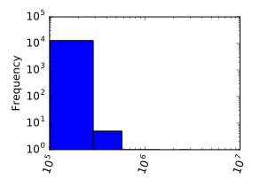
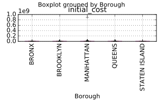
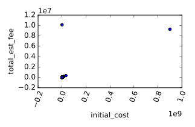

&copy; Copyright for Shuang Wu 2017<br>
Cite from the DataCamp website<br>
**Do not cite this notebook in any situation**<br>
Persenoal reference only, **do not copy** the code or others

- [Diagnose data for cleaning](#diagnose-data-for-cleaning)
    - [Loading and viewing data](#loading-and-viewing-data)
    - [Futher diagnosis](#futher-diagnosis)
- [Exploratory data analy](#exploratory-data-analy)
    - [Calculating summary statistics](#calculating-summary-statistics)
    - [Freq. counts for categorical data](#freq-counts-for-categorical-data)
- [Visual exploratory data analysis](#visual-exploratory-data-analysis)
    - [Visualizing single variables w/ histograms](#visualizing-single-variables-w-histograms)
    - [Visualizing multiple variables w/ boxplots](#visualizing-multiple-variables-w-boxplots)
    - [Visualizing multiple variables w/ scatter plots](#visualizing-multiple-variables-w-scatter-plots)

# Diagnose data for cleaning

* Cleaning data
    * prepare data for analysis
    * data almost never comes in clean
    * diagnose data for cleaning
* Common data problems
    * inconsistent col. name
    * missing data
    * outliers
    * duplicate rows
    * untidy
    * need to process col.
    * col. types can single unexpected data val.
* Load data
    * panda
* Visually inspect
    * head and tail
    * columns
    * shape
    * info


## Loading and viewing data
* Load inspect the DataFrame
    * .head()
    * .tail()
    * .shape
    * .columns


```python
import pandas as pd
df = pd.read_csv('dob_job_application_filings_subset.csv')
print(df.head())
print(df.tail())
print(df.shape)
print(df.columns)
print(df_subset.head())
print(df_subset.tail())
```

## Futher diagnosis

* Unclear or missing data
    * .info()
        * provides info. about df
            * #of rows
            * #of cols
            * #of non-missing val in each col.
            * data type for each col
            * help check whether float or string
            * also check complete data or missing


```python
print(df.info())
print(df_subset.info())
```

# Exploratory data analy

* Freq. counts
    * count the # of unique values in our data
    * df.info()
    * dropna=False
* Summary statistics
    * numeric col.
    * outliers
        * considerably higher or lower
        * require further investigation
        
## Calculating summary statistics

* Use *.describe()* method to calculate summary statistics of the data
* Some columns like *Job#* are encoded as numeric col., but it does not make sense to compute summary statistics for such cols.
```python
df.describe()
```

## Freq. counts for categorical data

* *.describe()* can only be used on numeric cols. 
* *.value_counts()* can apply to categorical data
    * return the freq. counts for each unique val. in a col.
    * optional para. *dropna*
        * *True* by defalut
        * not give a freq. count for missing data in a col.
        * Set to *False* if missing in a col. and want to the freq. counts
```python {.input}
print(df['Borough'].value_counts(dropna=False))
print(df['State'].value_counts(dropna=False))
print(df['Site Fill'].value_counts(dropna=False))
```
```python {.output}
    MANHATTAN        6310
    BROOKLYN         2866
    QUEENS           2121
    BRONX             974
    STATEN ISLAND     575
    Name: Borough, dtype: int64
    NY    12391
    NJ      241
    PA       38
    CA       20
    OH       19
    IL       17
    FL       17
    CT       16
    TX       13
    TN       10
    DC        7
    MD        7
    GA        6
    KS        6
    MA        6
    VA        5
    CO        4
    MN        3
    WI        3
    AZ        3
    SC        3
    RI        2
    UT        2
    NC        2
    NM        1
    WA        1
    IN        1
    VT        1
    MI        1
    Name: State, dtype: int64
    NOT APPLICABLE                              7806
    NaN                                         4205
    ON-SITE                                      519
    OFF-SITE                                     186
    USE UNDER 300 CU.YD                          130
    Name: Site Fill, dtype: int64
```

# Visual exploratory data analysis

* Data visualization
    * Great way to spot outliers and obvious errors
    * More than just looking for patterns
    * Plan data cleaning 
* Bar plots and histograms
    * Bar plots for discrete data counts
    * Histograms for continuous data counts
* Identifying the error
    * Not all outliers are bad data pts.
    * some can be error, but other are valid values
* Box plots
    * visualize basic summary statistics
        * outliers
        * Min/Max
        * 25th, 50t, 75th percentage
* Scatter plots
    * relationship b/w 2 numeric variables
    * flag potentially bad data
        * errors not found by looking at 1 variable

## Visualizing single variables w/ histograms

* *.plot()* method allows to create a plot of ach col. of a DataFrame
    * *kind* parameter allows specify the type of plot to use
        * *kind='hist'* for histgram
    * plot on log scale
        * *logx=True* and *logy=True* parameter
* Python will render a plot s.t. axis hold all info.
* If end up w/ large amounts of whitespace in plot, it indicates counts or values too small to render
```python {.input}
import matplotlib.pyplot as plt
df['Existing Zoning Sqft'].plot(kind='hist', rot=70, logx=True, logy=True)
plt.show()
```


## Visualizing multiple variables w/ boxplots

* Hist. is great way of visualizing single variables. For multiple variables, use boxplots, especially when one variable is categorical
* *.boxplot()*
    * specift the *column* and *by* parameters.
```python {.input} 
import pandas as pd
import matplotlib.pyplot as plt
df.boxplot(column='initial_cost', by='Borough', rot=90)
plt.show()
```


## Visualizing multiple variables w/ scatter plots

* For two numeric cols. scatter plots are ideal
    * *.plot()* method w/ *kind='scatter'*
    * When outliers dominate the plot, an additional DF, *df_subset*, has been probided, in which some of the extreme values have been removed.
```python {.input}
import pandas as pd
import matplotlib.pyplot as plt
df.plot(kind='scatter', x='initial_cost', y='total_est_fee', rot=70)
plt.show()
df_subset.plot(kind='scatter', x='initial_cost', y='total_est_fee', rot=70)
plt.show()
```



