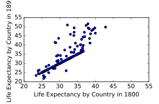
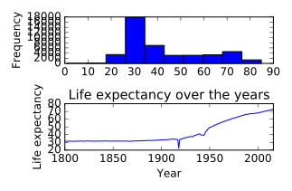

&copy; Copyright for Shuang Wu 2017<br>
Cite from the DataCamp website<br>
**Do not cite this notebook in any situation**<br>
Persenoal reference only, **do not copy** the code or others
- [Putting it all together](#putting-it-all-together)
    - [Exploratory analysis](#exploratory-analysis)
    - [Visualizing your data](#visualizing-your-data)
    - [Thinking about the question at hand](#thinking-about-the-question-at-hand)
    - [Assembling data](#assembling-data)
- [Initial impression of the data](#initial-impression-of-the-data)
    - [Reshaping data](#reshaping-data)
    - [Checking the data types](#checking-the-data-types)
    - [Looking at country spellings](#looking-at-country-spellings)
    - [More data cleaning and processing](#more-data-cleaning-and-processing)
    - [Wrapping up](#wrapping-up)
- [Final thoughts](#final-thoughts)


# Putting it all together

* Putting it all together
    * Use the techniques learned on Gapminder data
    * Clean and tidy data saved to a file
        * ready to be loaded for analysis
    * Dataset consists of life expectancy by contry and year
    * Data will come in multiple parts
        * load
        * preliminary quality diagnosis
        * combine into single dataset
* Combining data
    * merge
    * concatenate

## Exploratory analysis

* Whenever obtain a new dataset, first task should always be to do some exploratory analysis to get a better understanding of the data and diagnose it for any potential issues

## Visualizing your data

* The goal is to visually check the data for insights as well as errors
* When looking at the plot, pay attention to whether the scatter plot takes the form of a diagonal line, and which points fall below or above the diagonal line

```python {.input}
import matplotlib.pyplot as plt
g1800s.plot(kind='scatter', x='1800', y='1899')
plt.xlabel('Life Expectancy by Country in 1800')
plt.ylabel('Life Expectancy by Country in 1899')
plt.xlim(20, 55)
plt.ylim(20, 55)
plt.show()
```
Output:<br>


## Thinking about the question at hand

* Can write a func. that can apply over the entire DF to verify some of these assumptions
* Spending the time to write such a script will help when working w/ other datasets as well

```python {.input}
def check_null_or_valid(row_data):
    """Function that takes a row of data,
    drops all missing values,
    and checks if all remaining values are greater than or equal to 0
    """
    no_na = row_data.dropna()[1:-1]
    numeric = pd.to_numeric(no_na)
    ge0 = numeric >= 0
    return ge0
assert g1800s.columns[0] == 'Life expectancy'
assert g1800s.iloc[:, 1:].apply(check_null_or_valid, axis=1).all().all()
assert g1800s['Life expectancy'].value_counts()[0] == 1
```

## Assembling data

* Concatenate DFs into a single DF. This is row-wise concatenation.

```python {.input}
gapminder = pd.concat([g1800s, g1900s, g2000s])
print(gapminder.shape)
print(gapminder.head(5))
```
Output:<br>
 <center>   (780, 218) </center>

Index | 1800 | 1801 | 1802 | 1803 | 1804 | 1805 | 1806 | 1807 | 1808 | 1809 | ... | 2008 | 2009 | 2010 | 2011 | 2012 | 2013 | 2014 | 2015 | 2016 | Life expectancy
------|------|------|------|------|------|------|------|------|------|------|-----|------|------|------|------|------|------|------|------|------|----------------
0 | NaN | NaN | NaN | NaN | NaN | NaN | NaN | NaN | NaN | NaN | ... | NaN | NaN | NaN | NaN | NaN | NaN | NaN | NaN | NaN | Abkhazia
1 | 28.21 | 28.20 | 28.19 | 28.18 | 28.17 | 28.16 | 28.15 | 28.14 | 28.13 | 28.12 | ... | NaN | NaN | NaN | NaN | NaN | NaN | NaN | NaN | NaN | Afghanistan
2 | NaN | NaN | NaN | NaN | NaN | NaN | NaN | NaN | NaN | NaN | ... | NaN | NaN | NaN | NaN | NaN | NaN | NaN | NaN | NaN | Akrotiri and Dhekelia
3 | 35.40 | 35.40 | 35.40 | 35.40 | 35.40 | 35.40 | 35.40 | 35.40 | 35.40 | 35.40 | ... | NaN | NaN | NaN | NaN | NaN | NaN | NaN | NaN | NaN | Albania
4 | 28.82 | 28.82 | 28.82 | 28.82 | 28.82 | 28.82 | 28.82 | 28.82 | 28.82 | 28.82 | ... | NaN | NaN | NaN | NaN | NaN | NaN | NaN | NaN | NaN | Algeria

[5 rows x 218 columns]

# Initial impression of the data

* Principles of tidy data
    * rows for m observations
    * col. form variables
    * Tidying data will make data cleaning easier
    * Melting turns columns into rows
    * Pivot will take unique values from a column and create new columns
* Checking data types

## Reshaping data

* Convert the DF into the desired tidy format by melting it

```python {.input}
gapminder_melt = pd.melt(gapminder, id_vars='Life expectancy')
gapminder_melt.columns = ['country', 'year', 'life_expectancy']
print(gapminder_melt.head())
```
Output:<br>

Index | country | year | life_expectancy
------|---------|------|----------------
0 | Abkhazia | 1800 | NaN
1 | Afghanistan | 1800 | 28.21
2 | Akrotiri and Dhekelia | 1800 | NaN
3 | Albania | 1800 | 35.40
4 | Algeria | 1800 | 28.82

## Checking the data types

* Ensure the cols. are of the proper data type

```python {.import}
gapminder.year = pd.to_numeric(gapminder.year)
assert gapminder.country.dtypes == np.object
assert gapminder.year.dtypes == np.int64
assert gapminder.life_expectancy.dtypes == np.float64
```

## Looking at country spellings

* Invert the boolean can be done using _~_
* The pattern for the following code:
    * the set of lower and upper case letters
    * whitespace b/w rods
    * periods for any abbreviations

```python {.input}
countries = gapminder.country
countries = countries.drop_duplicates()
pattern = '^[A-Za-z\.\s]*$'
mask = countries.str.contains(pattern)
mask_inverse = ~mask
invalid_countries = countries.loc[mask_inverse]
print(invalid_countries)
```
Output:<br>
49            Congo, Dem. Rep.<br>
50                 Congo, Rep.<br>
53               Cote d'Ivoire<br>
73      Falkland Is (Malvinas)<br>
93               Guinea-Bissau<br>
98            Hong Kong, China<br>
118    United Korea (former)\n<br>
131               Macao, China<br>
132             Macedonia, FYR<br>
145      Micronesia, Fed. Sts.<br>
161            Ngorno-Karabakh<br>
187             St. Barthélemy<br>
193     St.-Pierre-et-Miquelon<br>
225                Timor-Leste<br>
251      Virgin Islands (U.S.)<br>
252       North Yemen (former)<br>
253       South Yemen (former)<br>
258                      Åland<br>
Name: country, dtype: object<br>

## More data cleaning and processing

* Deal w/ the missing data
* Several strategies:
    * can drop the,
    * fille them in using the mean of the col. or row that the missing value is in (also known as [imputation](https://en.wikipedia.org/wiki/Imputation_(statistics)))
    * if dealing w/ time series data, usa a forward fill or backward fill, in which replace missing values in a col. w/ the most recent known value in the col.
* In general, it's not the best idea to drop missing values
    * b/c in doing so may end up throwing away useful info.
* It's important to carefully consider all options and understand how they will affect data
```python {.input}
assert pd.notnull(gapminder.country).all()
assert pd.notnull(gapminder.year).all()
# specify rows with any missing values should be dropped
gapminder = gapminder.dropna(axis=0, how='any')
print(gapminder.shape)
```
Output:<br>
(43857, 3)<br>

## Wrapping up

* Visualization and aggregation 
* Average using _.groupby()_ method
* save tidy and summarized DF to file using _.to_csv()_ method

```python {.input}
plt.subplot(2, 1, 1) 
gapminder.life_expectancy.plot(kind='hist')
gapminder_agg = gapminder.groupby('year')['life_expectancy'].mean()
print(gapminder_agg.head())
print(gapminder_agg.tail())
plt.subplot(2, 1, 2)
gapminder_agg.plot()
plt.title('Life expectancy over the years')
plt.ylabel('Life expectancy')
plt.xlabel('Year')
plt.tight_layout()
plt.show()
gapminder.to_csv('gapminder.csv')
gapminder_agg.to_csv('gapminder_agg.csv')
```
Output:<br>

year<br>
1800    31.486020<br>
1801    31.448905<br>
1802    31.463483<br>
1803    31.377413<br>
1804    31.446318<br>
Name: life_expectancy, dtype: float64<br>
year<br>
2012    71.663077<br>
2013    71.916106<br>
2014    72.088125<br>
2015    72.321010<br>
2016    72.556635<br>
Name: life_expectancy, dtype: float64<br>


# Final thoughts

* Learned how to ...
    * Load and view data in pandas
    * Visually inspect data for errors and potential problems
    * Tidy data for analysis and reshape it
    * Combine datasets
    * Clean data by using regular expressions and functions
    * Test your data and be proactive in finding potential errors