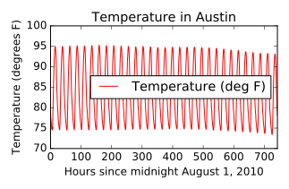
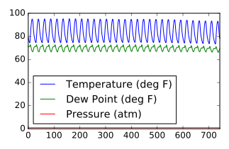
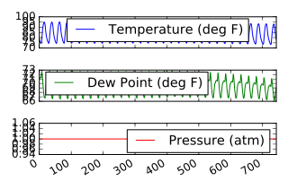
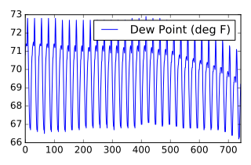
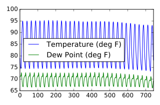

&copy; Copyright for Shuang Wu 2017<br>
Cite from the DataCamp website<br>
**Do not cite this notebook in any situation**<br>
Persenoal reference only, **do not copy** the code or others
- [Review of pandas DFs](#review-of-pandas-dfs)
    - [Inspecting your data](#inspecting-your-data)
    - [DF data types](#df-data-types)
    - [NumPy and pandas working together](#numpy-and-pandas-working-together)
- [Building Dfs from scratch](#building-dfs-from-scratch)
    - [Zip lists to build a DF](#zip-lists-to-build-a-df)
    - [Labeling your data](#labeling-your-data)
    - [Building DFs w/ broadcasting](#building-dfs-w-broadcasting)
- [Importing & exporting data](#importing-exporting-data)
    - [Reading a flat file](#reading-a-flat-file)
    - [Delimiters, headers, and extensions](#delimiters-headers-and-extensions)
- [Plotting using pandas](#plotting-using-pandas)
    - [Plotting series using pandas](#plotting-series-using-pandas)
    - [Plotting DFs](#plotting-dfs)

# Review of pandas DFs

* Pandas DataFrames
    * indexes and cols
    * slicing
    * head()
    * tail()
    * info()
    * Broadcasting
    * Series

## Inspecting your data
* DF methods: _.head()_, _.tail()_ to view the first few and last few rows of a DataFrame

## DF data types
* Pandas is aware of the data types in the cols of DF. It is also aware of null and _NaN_(Not-a-Number) types which often indicate missing data.
* Use _df.info()_ to determine info about the total count of _non-null_ entries and infer the total count of 'null' entries, which likely indicates missing data.

## NumPy and pandas working together
* Pandas depends upon and interoperates w/ NumPy,the python library for fast numeric array computations.
* Can use the DF attribute _.values_ to represent a DF _df_ as a Numpy array.
* Can also pass pandas data structures to Numpy methods
* Extract the values and store them in an array using the attribute _.values_
* use those values as input into the NumPy _np.log10()_ method to compute the base 10 logarithm
* pass the pandas DF into the same _np.log10()_ and compare the results

```python {.input}
# Import numpy
import numpy as np
# Create array of DataFrame values: np_vals
np_vals = df.values
# Create new array of base 10 logarithm values: np_vals_log10
np_vals_log10 = np.log10(np_vals)
# Create array of new DataFrame by passing df to np.log10(): df_log10
df_log10 = np.log10(df)
# Print original and new data containers
print(type(np_vals), type(np_vals_log10))
print(type(df), type(df_log10))
```
Output:<br>
    <class 'numpy.ndarray'> <class 'numpy.ndarray'><br>
    <class 'pandas.core.frame.DataFrame'> <class 'pandas.core.frame.DataFrame'>

# Building Dfs from scratch
* DF from CSV files
* DF from dict
* Broadcasting
* Broadcasting w/ a dict

## Zip lists to build a DF
* Use lists to construct a list of tuples, use the list of tuples to construct a dictionary, then use that dictionary to construct a DF.
* Use _list()_, _zip()_, _dict()_ and _pd.DataFrame()_
* Note: The [_zip()_](https://docs.python.org/3/library/functions.html#zip) function in python 3 and above returns a special zip object, which is essentially a generator. To convert this _zip_ object into a list, need to use _list()_.
```python 
# Zip the 2 lists together into one list of (key,value) tuples: zipped
zipped = list(zip(list_keys, list_values))
# Inspect the list using print()
print(zipped)
# Build a dictionary with the zipped list: data
data = dict(zipped)
# Build and inspect a DataFrame from the dictionary: df
df = pd.DataFrame(data)
print(df)
```
Output:<br>
    [('Country', ['United States', 'Soviet Union', 'United Kingdom']), ('Total', [1118, 473, 273])]<br>
index | Country | Total
------|---------|------
0 | United States | 1118
1 | Soviet Union | 473
2 | United Kingdom | 273

## Labeling your data
* Use DF attribute _df.columns_ to view and assign new string labels to cols in a padnas DF.

```python
# Build a list of labels: list_labels
list_labels = ['year', 'artist', 'song', 'chart weeks']
# Assign the list of labels to the columns attribute: df.columns
df.columns = list_labels
```

## Building DFs w/ broadcasting

* Can implicitly use 'broadcasting', a feature of NumPy, when creating pandas DFs.

```python
# Make a string with the value 'PA': state
state = 'PA'
# Construct a dictionary: data
data = {'state':state, 'city':cities}
# Construct a DataFrame from dictionary data: df
df = pd.DataFrame(data)
# Print the DataFrame
print(df)
```
Output:<br>
index | city | state
------|------|------
0 | Manheim | PA
1 | Preston park | PA
2 | Biglerville | PA
3 | Indiana | PA
4 | Curwensville | PA
5 | Crown | PA
6 | Harveys lake | PA
7 | Mineral springs | PA
8 | Cassville | PA
9 | Hannastown | PA
10 | Saltsburg | PA
11 | Tunkhannock | PA
12 | Pittsburgh | PA
13 | Lemasters | PA
14 | Great bend | PA

# Importing & exporting data

* Original CSV file
    * Dataset: sunspot observations collected from SILSO
* Datasets from CSV files
* problems
    * csv file has no column headers
        * cols o-2: Gregorian data
        * Col 3: Date as fraction as year
        * Col 4: Daily total sunspot number
        * Col 5: Definitive/provisional indicator (1 or 0)
    * Missing values in column 4: indicated by -1
* Dates representation inconvenient
* using header keyword
* using names keyword
* using na_values keyword
* using parse_dates keyword
* inspecting DataFrame
* using dates as index
* trimming redundant cols
* writing files

## Reading a flat file
* Preload the data using the pandas function _read_csv()_
* reread the same file, but simultaneously rename the cols using the _names_ keyword input parameter, set equal to a list of new col labels.
* set _header=0_ to rename the col labels

```python
# Read in the file: df1
df1 = pd.read_csv('world_population.csv')
# Create a list of the new column labels: new_labels
new_labels = ['year', 'population']
# Read in the file, specifying the header and names parameters: df2
df2 = pd.read_csv('world_population.csv', header=0, names=new_labels)
# Print both the DataFrames
print(df1)
print(df2)
```
Output:<br>
Index | Year | Total Population
------|------|-----------------
0 | 1960 | 3.034971e+09
1 | 1970 | 3.684823e+09
2 | 1980 | 4.436590e+09
3 | 1990 | 5.282716e+09
4 | 2000 | 6.115974e+09
5 | 2010 | 6.924283e+09

Index | year | population
------|------|-----------
0 | 1960 | 3.034971e+09
1 | 1970 | 3.684823e+09
2 | 1980 | 4.436590e+09
3 | 1990 | 5.282716e+09
4 | 2000 | 6.115974e+09
5 | 2010 | 6.924283e+09

## Delimiters, headers, and extensions
* Pnadas provides methods for reading those not-so-perfect data files that encounter far too often
* 3 aspects that may cause trouble for lesser tools: multiple header lines, comment records (rows) interleaved throughout the data rows, and tab delimiters instead of commas

```python
# Read the raw file as-is: df1
df1 = pd.read_csv(file_messy)
# Print the output of df1.head()
print(df1.head())
# Read in the file with the correct parameters: df2
df2 = pd.read_csv(file_messy, delimiter=' ', header=3, comment='#')
# Print the output of df2.head()
print(df2.head())
# Save the cleaned up DataFrame to a CSV file without the index
df2.to_csv(file_clean, index=False)
# Save the cleaned up DataFrame to an excel file without the index
df2.to_excel('file_clean.xlsx', index=False)
```
Output:<br>
                                                  The following stock data was collect on 2016-AUG-25 from an unknown source
    These kind of comments are not very useful                                                  are they?                        
    Probably should just throw this line away too          but not the next since those are column labels                        
    name Jan Feb Mar Apr May Jun Jul Aug Sep Oct No...                                                NaN                        
    # So that line you just read has all the column...                                                NaN                        
    IBM 156.08 160.01 159.81 165.22 172.25 167.15 1...                                                NaN                        <br>

name | Jan | Feb | Mar | Apr | May | Jun | Jul | Aug | Sep | Oct | Nov | Dec
-----|-----|-----|-----|-----|-----|-----|-----|-----|-----|-----|-----|----
IBM | 156.08 | 160.01 | 159.81 | 165.22 | 172.25 | 167.15 | 164.75 | 152.77 | 145.36 | 146.11 | 137.21 | 137.96
MSFT | 45.51 | 43.08 | 42.13 | 43.47 | 47.53 | 45.96 | 45.61 | 45.51 | 43.56 | 48.70 | 53.88 | 55.40
GOOGLE | 512.42 | 537.99 | 559.72 | 540.50 | 535.24 | 532.92 | 590.09 | 636.84 | 617.93 | 663.59 | 735.39 | 755.35
APPLE | 110.64 | 125.43 | 125.97 | 127.29 | 128.76 | 127.81 | 125.34 | 113.39 | 112.80 | 113.36 | 118.16 | 111.73

# Plotting using pandas
* AAPL stock data
* Plotting arrays (matplotlib)
* plotting series (pandas)
* plotting DFs (pandas)
* plotting DFs (matplotlib)
* Fixing scales
* customizing plots
* saving plots

## Plotting series using pandas
* Data visualization is often a very effective 1st step in gaining a rough understanding of a data set to be analyzed.
* Pandas provides data visualization by both depending upon and interoperating w/ the maiplotlib library
* Use the DF method _df.plot()_ to visualize the data, then explore the optional matplotlib input parameters that this _.plot()_ method accepts
* The pandas _.plot()_ method makes calls to matplotlib to construct the plots.

```python
# Create a plot with color='red'
df.plot(color='red')
# Add a title
plt.title("Temperature in Austin")
# Specify the x-axis label
plt.xlabel('Hours since midnight August 1, 2010')
# Specify the y-axis label
plt.ylabel('Temperature (degrees F)')
# Display the plot
plt.show()
```
Output:<br>


## Plotting DFs
* Comparing data from several cols can be very illuminating. Pandas makes doing so easy w/ multi-column DFs
* Calling _df.plot()_ will cause pandas to over-plot all col data, w/ each col as a single line
* Use a list of column names passed into the DF _df[column_list]_ to limit plotting to just one col, and then just 2 cols of data
```python
# Plot all columns (default)
df.plot()
plt.show()
# Plot all columns as subplots
df.plot(subplots=True)
plt.show()
# Plot just the Dew Point data
column_list1 = ['Dew Point (deg F)']
df[column_list1].plot()
plt.show()
# Plot the Dew Point and Temperature data, but not the Pressure data
column_list2 = ['Temperature (deg F)','Dew Point (deg F)']
df[column_list2].plot()
plt.show()
```
Output:<br>



