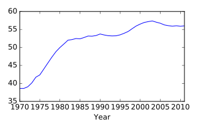
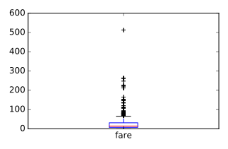
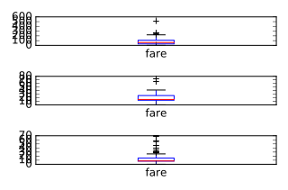

&copy; Copyright for Shuang Wu 2017<br>
Cite from the DataCamp website<br>
**Do not cite this notebook in any situation**<br>
Persenoal reference only, **do not copy** the code or others
- [Visual exploratory data analysis](#visual-exploratory-data-analysis)
    - [Pandas line plots](#pandas-line-plots)
    - [Pandas scatter plots](#pandas-scatter-plots)
    - [pandas box plots](#pandas-box-plots)
    - [pandas hist, pdf and cdf](#pandas-hist-pdf-and-cdf)
- [Statistical exploratory data analysis](#statistical-exploratory-data-analysis)
    - [Fuel efficientcy](#fuel-efficientcy)
    - [Bachelor's degrees awarded to women](#bachelors-degrees-awarded-to-women)
    - [Median vs mean](#median-vs-mean)
    - [Quantiles](#quantiles)
    - [Standard deviation of temperature](#standard-deviation-of-temperature)
- [Separating populations w/ith Boolean indexin](#separating-populations-with-boolean-indexin)
    - [Filtering and counting](#filtering-and-counting)
    - [Separate and summarize](#separate-and-summarize)
    - [Separate and plot](#separate-and-plot)
# Visual exploratory data analysis
* The iris data set
* Data import
* Line plot
* Scatter plot
* Box plot
* Histogram (options)
    * bins(integer): # of intervals or bins
    * range(tuple): extrema of bins(minimum, maximum)
    * normed(boolean): whether to normalize to one
    * cumulative(boolean): compute Cumulative Distribution Function(CDF)
* more matplotlib
* Customizing histogram
* Cumulative distribution
* word of warning
    * 3 different DF plot idioms
        * iris.plot(kind='hist')
        * iris.plt.hist()
        * iris.hist()
    * Syntax/results differ

## Pandas line plots
* _.plot()_ method place the index vals on the x-axis by default
* making line plots w/ specific columns on the x and y axes

```python
# Create a list of y-axis column names: y_columns
y_columns = ['AAPL', 'IBM']
# Generate a line plot
df.plot(x='Month', y=y_columns)
# Add the title
plt.title('Monthly stock prices')
# Add the y-axis label
plt.ylabel('Price ($US)')
# Display the plot
plt.show()
```
Output:<br>


## Pandas scatter plots
* Generated using the _kind='scatter'_ keyword argument
* scatter plots require that the x and y cols be chosen by specifying the _x_ and _y_ parameters inside _.plot()_
* scatter plots also take an _s_ keyword argument to provide the radius of each circle to plot in pixels
* size of each circle is provided as a Numpy array called _sizes_

```python
# Generate a scatter plot
df.plot(kind='scatter', x='hp', y='mpg', s=sizes)
# Add the title
plt.title('Fuel efficiency vs Horse-power')
# Add the x-axis label
plt.xlabel('Horse-power')
# Add the y-axis label
plt.ylabel('Fuel efficiency (mpg)')
# Display the plot
plt.show()
```
Output:<br>


## pandas box plots
* pandas can plot multiple cols of data in a single figure, making plots that share the same x and y axes, there are case where 2 cols cannot be plotted together b/c their units do not match
* _.plot()_ method can generate subplots for each col being plotted

```python
# Make a list of the column names to be plotted: cols
cols = ['weight', 'mpg']
# Generate the box plots
df[cols].plot(kind='box', subplots=True)
# Display the plot
plt.show()
```
Output:<br>


## pandas hist, pdf and cdf
* Pandas relies on the _.hist()_ method to not only generate histograms, but also plots of probability density functions(PDFs) and cumulative density functions(CDFs)
* When plotting the PDF, need to specify _normed=True_ when call to _.hist()_
* When plotting CDF, need to specify _cumulative=True_ in addition to _normed=True_

```python
# This formats the plots such that they appear on separate rows
fig, axes = plt.subplots(nrows=2, ncols=1)
# Plot the PDF
df.fraction.plot(ax=axes[0], kind='hist', normed=True, bins=30, range=(0,.3))
plt.show()
# Plot the CDF
df.fraction.plot(ax=axes[1], kind='hist', normed=True, bins=30, cumulative=True, range=(0,.3))
plt.show()
```
Output:<br>


# Statistical exploratory data analysis

* Summarizing with describe()
* Describe
    * count
    * mean
    * std
    * medians
    * min
    * 25%
    * 50%
    * 75%
    * max
    * inter0quartile range(IRQ)
    * ranges

## Fuel efficientcy
* _.median()_

```python
df['mpg'].median()
```
Output: 22.75

## Bachelor's degrees awarded to women
* Use _.mean()_ method w/ the keyword argument _axis='columns'_
    * compute the mean across all cols per row

```python
# Print the minimum value of the Engineering column
print(df['Engineering'].min())
# Print the maximum value of the Engineering column
print(df['Engineering'].max())
# Construct the mean percentage per year: mean
mean = df.mean(axis='columns')
# Plot the average percentage per year
mean.plot()
# Display the plot
plt.show()
```
Output:     0.8  19.0<br>


## Median vs mean

* In many data sets, there can be large differences in the mean and median val. due to the presence of outliers

```python
# Print summary statistics of the fare column with .describe()
print(df['fare'].describe())
# Generate a box plot of the fare column
df['fare'].plot(kind='box')
# Show the plot
plt.show()
```
Output:<br>
column0 | column1
------- | -------
count | 1308.000000
mean | 33.295479
std | 51.758668
min | 0.000000
25% | 7.895800
50% | 14.454200
75% | 31.275000
max | 512.329200
Name: fare, dtype: float64<br>



## Quantiles

```python
# Print the number of countries reported in 2015
print(df['2015'].count())
# Print the 5th and 95th percentiles
print(df.quantile([0.05,0.95]))
# Generate a box plot
years = ['1800','1850','1900','1950','2000']
df[years].plot(kind='box')
plt.show()
```
Output: 208<br>
quant | Unnamed: 0 | 1800 | 1801 | 1802 | 1803 | 1804 | 1805 | 1806 | 1807 | 1808 | ... | 2007 | 2008 | 2009 | 2010 | 2011 | 2012 | 2013 | 2014 | 2015 | 2016
------|------------|------|------|------|------|------|------|------|------|------|-----|------|------|------|------|------|------|------|------|------|-----
0.05 | 12.95 | 25.40 | 25.30 | 25.20 | 25.2 | 25.2 | 25.40 | 25.40 | 25.40 | 25.3 | ... | 53.07 | 53.60 | 54.235 | 54.935 | 55.97 | 56.335 | 56.705 | 56.87 | 57.855 | 59.2555
0.95 | 246.05 | 37.92 | 37.35 | 38.37 | 38.0 | 38.3 | 38.37 | 38.37 | 38.37 | 38.0 | ... | 80.73 | 80.93 | 81.200 | 81.365 | 81.60 | 81.665 | 81.830 | 82.00 | 82.100 | 82.1650
 [2 rows x 218 columns]

 ## Standard deviation of temperature

```python
# Print the mean of the January and March data
print(january.mean(), march.mean())
# Print the standard deviation of the January and March data
print(january.std(), march.std())
```
Output:<br>
```python
    Temperature    32.354839
    dtype: float64 Temperature    35.0
    dtype: float64
    Temperature    13.583196
    dtype: float64 Temperature    7.478859
    dtype: float64
```

# Separating populations w/ith Boolean indexin

* Describe species column
* Unique & factors
* Filtering by species
* Checking species
* Checking indexes
* Visual EDA: all data
* Visual EDA: individual factors
* Statistical EDA: describe()
* Computing errors
* Viewing errors

## Filtering and counting
```python
df[df['origin'] == 'US']
df[df['origin'] == 'US'].count()
```

## Separate and summarize

```python
# Compute the global mean and global standard deviation: global_mean, global_std
global_mean = df.mean()
global_std = df.std()
# Filter the US population from the origin column: us
us = df[df['origin']=='US']
# Compute the US mean and US standard deviation: us_mean, us_std
us_mean = us.mean()
us_std = us.std()
# Print the differences
print(us_mean - global_mean)
print(us_std - global_std)
```
Output: <br>
column0 | column1
------- | -------
mpg | -3.412449
cyl | 0.805612
displ | 53.100255
hp | 14.579592
weight | 394.905612
accel | -0.551122
yr | -0.387755
dtype: float64
column0 | column1
------- | -------
mpg | -1.364623
cyl | -0.049788
displ | -6.267657
hp | 1.406630
weight | -54.055870
accel | -0.022844
yr | -0.023369
dtype: float64

## Separate and plot
* Population filtering can be used alongside plotting to quickly determine differences in distributions between the sub-populations

```python
# Display the box plots on 3 separate rows and 1 column
fig, axes = plt.subplots(nrows=3, ncols=1)
# Generate a box plot of the fare prices for the First passenger class
titanic.loc[titanic['pclass'] == 1].plot(ax=axes[0], y='fare', kind='box')
# Generate a box plot of the fare prices for the Second passenger class
titanic.loc[titanic['pclass'] == 2].plot(ax=axes[1], y='fare', kind='box')
# Generate a box plot of the fare prices for the Third passenger class
titanic.loc[titanic['pclass'] == 3].plot(ax=axes[2], y='fare', kind='box')
# Display the plot
plt.show()
```
