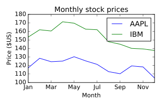
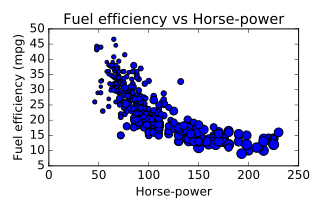
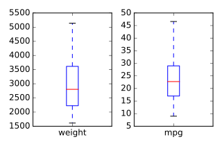
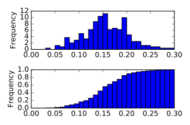

&copy; Copyright for Shuang Wu 2017<br>
Cite from the DataCamp website<br>
**Do not cite this notebook in any situation**<br>
Persenoal reference only, **do not copy** the code or others

# Visual exploratory data analysis
* The iris data set
* Data import
* Line plot
* Scatter plot
* Box plot
* Histogram (options)
    * bins(integer): # of intervals or bins
    * range(tuple): extrema of bins(minimum, maximum)
    * normed(boolean): whether to normalize to one
    * cumulative(boolean): compute Cumulative Distribution Function(CDF)
* more matplotlib
* Customizing histogram
* Cumulative distribution
* word of warning
    * 3 different DF plot idioms
        * iris.plot(kind='hist')
        * iris.plt.hist()
        * iris.hist()
    * Syntax/results differ

## Pandas line plots
* _.plot()_ method place the index vals on the x-axis by default
* making line plots w/ specific columns on the x and y axes

```python
# Create a list of y-axis column names: y_columns
y_columns = ['AAPL', 'IBM']
# Generate a line plot
df.plot(x='Month', y=y_columns)
# Add the title
plt.title('Monthly stock prices')
# Add the y-axis label
plt.ylabel('Price ($US)')
# Display the plot
plt.show()
```
Output:<br>


## Pandas scatter plots
* Generated using the _kind='scatter'_ keyword argument
* scatter plots require that the x and y cols be chosen by specifying the _x_ and _y_ parameters inside _.plot()_
* scatter plots also take an _s_ keyword argument to provide the radius of each circle to plot in pixels
* size of each circle is provided as a Numpy array called _sizes_

```python
# Generate a scatter plot
df.plot(kind='scatter', x='hp', y='mpg', s=sizes)
# Add the title
plt.title('Fuel efficiency vs Horse-power')
# Add the x-axis label
plt.xlabel('Horse-power')
# Add the y-axis label
plt.ylabel('Fuel efficiency (mpg)')
# Display the plot
plt.show()
```
Output:<br>


## pandas box plots
* pandas can plot multiple cols of data in a single figure, making plots that share the same x and y axes, there are case where 2 cols cannot be plotted together b/c their units do not match
* _.plot()_ method can generate subplots for each col being plotted

```python
# Make a list of the column names to be plotted: cols
cols = ['weight', 'mpg']
# Generate the box plots
df[cols].plot(kind='box', subplots=True)
# Display the plot
plt.show()
```
Output:<br>


## pandas hist, pdf and cdf
* Pandas relies on the _.hist()_ method to not only generate histograms, but also plots of probability density functions(PDFs) and cumulative density functions(CDFs)
* When plotting the PDF, need to specify _normed=True_ when call to _.hist()_
* When plotting CDF, need to specify _cumulative=True_ in addition to _normed=True_

```python
# This formats the plots such that they appear on separate rows
fig, axes = plt.subplots(nrows=2, ncols=1)
# Plot the PDF
df.fraction.plot(ax=axes[0], kind='hist', normed=True, bins=30, range=(0,.3))
plt.show()
# Plot the CDF
df.fraction.plot(ax=axes[1], kind='hist', normed=True, bins=30, cumulative=True, range=(0,.3))
plt.show()
```
Output:<br>


# Statistical exploratory data analysis

# Separating populations w/ith Boolean indexin
